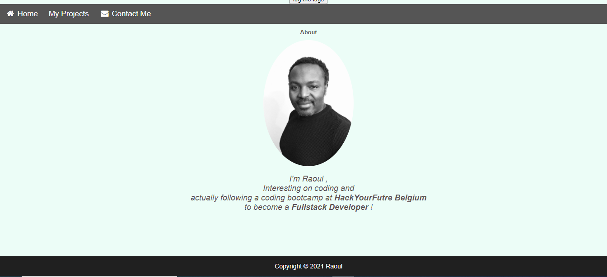

# Building a Portfolio: Practical JavaScript

A refactor of the Practical JavaScript Portfolio

---

## Data

> describe the data used in your project.
>
> - Json data
> 

---

## User Story Dependencies

---

## WIREFRAME

---

## 0.Setup

- Start a repo.
- turn on Github pages
---

## 1. Initialize Application

**As a user I want to see the home page when I load the site**

- a picture
- a contact button
- a text with a small description of the owner of the portfolio
- a My Project button

### REPO

- This user story is developed on branch `devstra`.
- This branch is merged to `master` branch after completion.

### Task A : Build de home page

 - Create a branch
 - create a file about.html
 - create a navigation bar
 - add a picture
 - add a paragraph
 - add some styles.
 This will be develop in the branch `home`  after completion merge this branch to the `master`

### Task B: Build the page My Projects

 - Create a branch `projects`
 - create the file index.html
 - add the navigation bar
 - fetch the data from Github (using Github APi)
 - add some styles to the page 
 - merge `projects` to `master` after completion

### Task C: Contact Page 
 - create a branch `contact`
 - create a file contact.html
 - add the navigation bar
 - create a contact form with four entries
 - add some styles to the form
 - merge `contact` to `master` after completion

---
### Technologies Used
 - HTML
 - CSS
 - JAVASCRIPT (Fetch APi)
 - BOOTSTRAAP